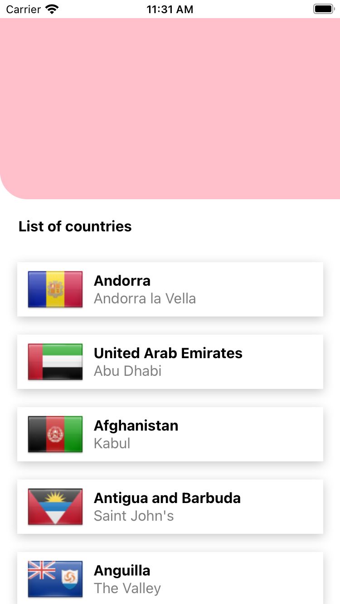
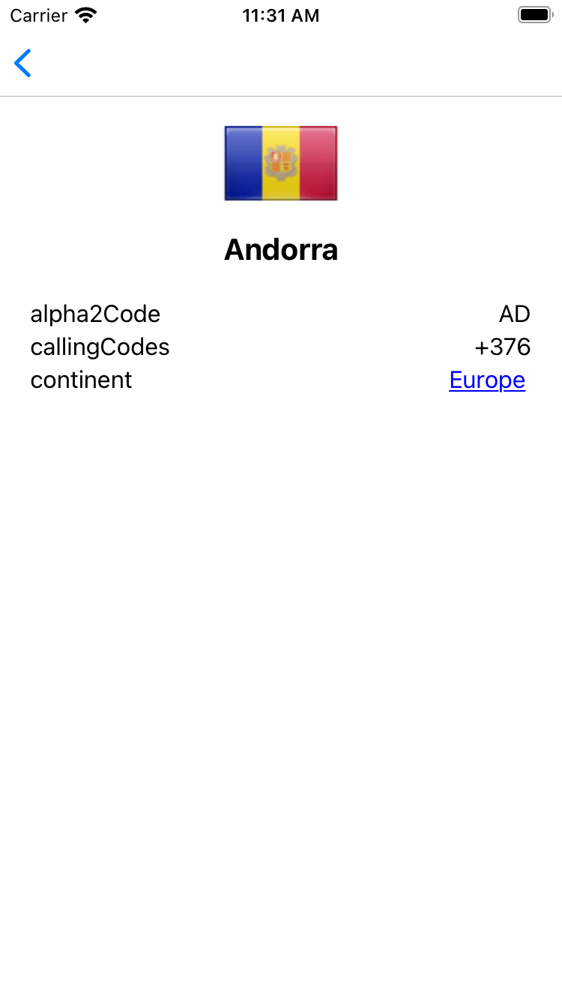
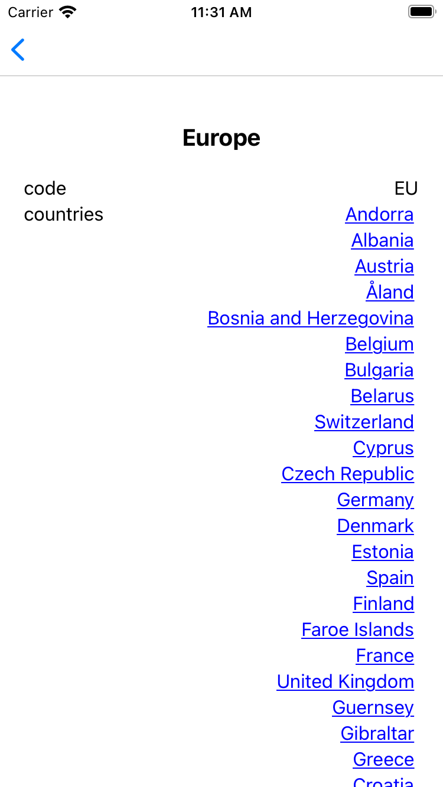

## How to work on this mini-project?

- Clone this repository to your local machine
- Create a repository on your GitHub account and submit the solution there when you're done.
- Send us the URL to your repository via email and we'll contact you with the feedbacks.

**The API data is at https://countries.trevorblades.com/**.

To make it easier to breath, this problem spans across 48 hours. You don't have to make it 100% the same to the images, only the idea. We hope to receive your work in its best shape. Please do not hesitate to ask for more information if necessary.

# RNHW

You took the role to develop a React Native app which has the following features:

- Show a list of countries

- When user taps on a country, show country screen

- When user taps on a continent, show continent screen with a list of countries of the continent

- App should have a floating button throughout screens to switch between light and dark mode.
- When user taps on a country on the continent screen, show the country screen again
- When user visits [rnhw://country/:code](rnhw://country/:code), show country screen
- When user visits [rnhw://continent/:code](rnhw://continent/:code), show continent screen.
